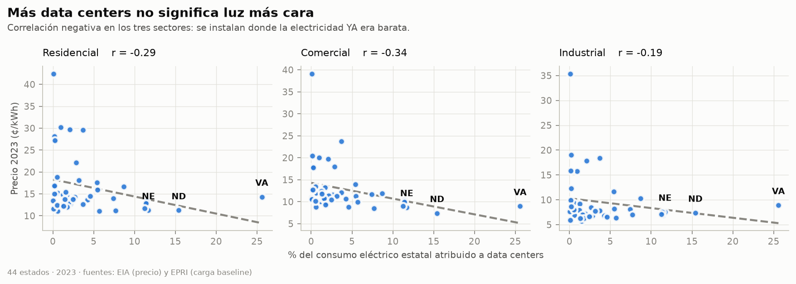
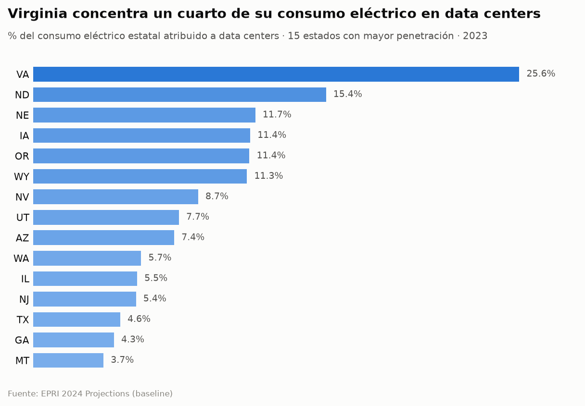
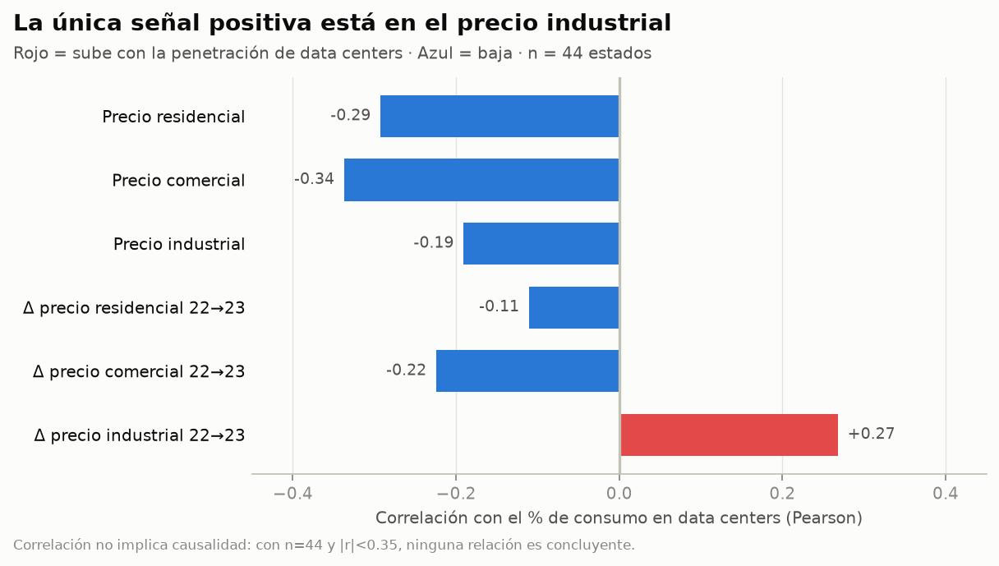

# datacenter-impact

[](https://github.com/alepsmn/datacenter-impact/actions/workflows/ci.yml)

**Pipeline ELT que cuantifica la relación entre la carga eléctrica proyectada de los
data centers y el precio de la electricidad en EEUU, a nivel estado.**

Combina datos históricos reales de precios y consumo (EIA) con proyecciones de demanda
de data centers (EPRI), los modela en BigQuery con dbt y orquesta todo el flujo con
Airflow. End-to-end, reproducible, con tests.

> **Stack:** Python · Google Cloud Storage · BigQuery · dbt · Apache Airflow (Celery) · Docker

---

## Qué problema resuelve

El crecimiento de los data centers (impulsado por IA) dispara la demanda eléctrica. La
pregunta de negocio: **¿se traduce esa carga adicional en precios más altos para el
consumidor, y dónde?** Este proyecto construye la base de datos analítica para responderla,
cruzando dos fuentes que no hablan el mismo idioma (granos, años y cobertura distintos).

## Hallazgos

La respuesta corta a la pregunta de negocio es **no**, y el "no" es más
interesante que un "sí".

<picture>
  <source media="(prefers-color-scheme: dark)" srcset="analysis/figures/scatter_pct_vs_price-dark.png">
  
</picture>

En los 44 estados con dato en ambas fuentes, la penetración de data centers
correlaciona **negativamente** con el precio de la electricidad en los tres
sectores. La lectura honesta no es "los data centers abaratan la luz", sino
**causalidad inversa**: los data centers se instalan donde la electricidad *ya*
era barata. Virginia, Dakota del Norte, Iowa, Oregón y Wyoming —los cinco
primeros del ranking— son estados de generación barata (hidráulica, eólica,
nuclear) y suelo abundante.

<picture>
  <source media="(prefers-color-scheme: dark)" srcset="analysis/figures/top_states-dark.png">
  
</picture>

Virginia es el caso extremo: **25,6% de todo su consumo eléctrico** va a data
centers, 10 puntos por encima del segundo. Es el "Data Center Alley" del norte
del estado.

<picture>
  <source media="(prefers-color-scheme: dark)" srcset="analysis/figures/correlations-dark.png">
  
</picture>

La única señal positiva aparece donde cabría esperarla: el **cambio** de precio
industrial 2022→2023 (r = +0,27). Los niveles de precio reflejan la estructura
histórica de cada estado; el delta se acerca más a medir presión reciente de
demanda. Con n = 44 y |r| < 0,35, nada de esto es concluyente — y decirlo forma
parte del análisis.

> Reproducir las figuras: `python analysis/plot_impact.py` (requiere BigQuery).
> La estadística está testeada aparte, en `tests/test_plot_impact.py`.

## Arquitectura

```
            ┌─────────────────┐        ┌──────────────────────────┐
  EIA API ─▶│ extract_eia.py  │        │  EPRI_2024_Projections   │
 (precios,  │  (paginado,     │        │        .xlsx             │
  ventas)   │   NDJSON)       │        └────────────┬─────────────┘
            └────────┬────────┘                     │
                     │                     ┌─────────▼─────────┐
                     │                     │ extract_epri.py   │
                     │                     │ (xlsx → NDJSON)   │
                     │                     └─────────┬─────────┘
                     │                               │
                     └──────────────┬────────────────┘
                                    ▼
                          ┌───────────────────┐
                          │  upload_gcs.py    │   Google Cloud Storage
                          │  (raw landing)    │   gs://…-raw/{eia,epri}
                          └─────────┬─────────┘
                                    ▼
                          ┌───────────────────┐
                          │ load_bigquery.py  │   BigQuery (raw tables)
                          │ (schema + load)   │   eia_electricity · epri_datacenter_load
                          └─────────┬─────────┘
                                    ▼
              ┌─────────────────────────────────────────────┐
              │                   dbt                        │
              │  staging  → stg_eia_electricity              │
              │             stg_epri_datacenter_load         │
              │  marts    → mart_electricity_by_sector       │
              │             mart_datacenter_price_impact      │
              └─────────────────────┬───────────────────────┘
                                    ▼
                          ┌───────────────────┐
                          │ analysis/         │   figuras del README
                          │ plot_impact.py    │   (matplotlib, claro + oscuro)
                          └───────────────────┘

  Todo el grafo lo orquesta Apache Airflow:
  [extract_eia, extract_epri] → upload_gcs → load_bigquery → dbt run → dbt test
```

## Fuentes de datos

| Fuente | Qué aporta | Cobertura | Grano |
|--------|-----------|-----------|-------|
| **EIA** (API v2, retail-sales) | precio, ventas, ingresos, clientes | 2015–2024, mensual | estado × sector (RES/COM/IND) |
| **EPRI** (2024 Projections, xlsx) | energía anual de data centers, % consumo estatal | 2023 (baseline) y 2030 (4 escenarios) | estado × escenario |

~22.300 registros EIA descargados de la API; EPRI extraído de Excel a NDJSON.

## Modelo de datos (dbt)

- **staging** — limpia y tipa el raw. `stg_eia_electricity` deriva `year`/`month` de `period`,
  renombra columnas a snake_case y filtra nulos. `stg_epri_datacenter_load` normaliza escenarios.
- **marts**
  - `mart_electricity_by_sector` — métricas agregadas por estado × sector × año.
  - `mart_datacenter_price_impact` — el corazón analítico: cruza precio EIA con carga EPRI
    a nivel estado, incluyendo el **delta de precio 2022→2023** por sector para correlacionar
    con la penetración de data centers.

**Tests dbt** (en `models/staging/schema.yml`): `not_null`, `unique` y `accepted_values`
sobre claves y categóricas (sectores, escenarios).

## Decisiones de diseño

Lo que diferencia este proyecto de un tutorial es que las fuentes **no encajan limpiamente**
y las decisiones están documentadas:

- **Grano del JOIN.** EIA cubre 2015–2024; EPRI solo tiene 2023 (baseline) y 2030
  (proyecciones). La única intersección real es **2023**. En vez de inventar filas para 2030,
  la mart de impacto filtra `scenario = 'baseline' AND year = 2023` → JOIN limpio sobre
  44 estados, planteado como un **análisis de correlación transversal (cross-sectional)**.
  Es la opción honesta con el dato.
- **Cobertura incompleta, no error de ingesta.** EPRI no incluye 6 estados (Alaska, Arkansas,
  Mississippi, West Virginia, Vermont, Delaware). Es una ausencia intencional de la fuente,
  documentada para no confundirla con un bug del pipeline.
- **Delta de precio como señal.** La mart calcula el cambio de precio 2022→2023 por sector,
  no solo el nivel, para acercarse a un análisis de impacto en vez de una foto estática.

## Tests

Dos niveles de test, uno por cada tipo de código del pipeline.

**Python (`pytest`)** — 86 tests sobre la lógica de extracción y análisis, en `tests/`:

- **`test_extract_epri.py`**
  - `STATE_TO_ID`: el mapa estado→código es correcto, cubre los 50 estados y
    respeta el formato (2 letras mayúsculas).
  - `row_to_records` (transformación pura, extraída de `extract()`): campos del
    registro, conversión MWh→GWh redondeada y los filtros de negocio (estados
    fuera del mapa y escenarios sin carga se descartan).
- **`test_extract_eia.py`**
  - `fetch_eia` con `requests` **mockeado**: reintenta ante 5xx/429, falla
    rápido ante un 403 (no reintenta) y agota los reintentos ante fallo
    persistente — sin tocar la red real.
  - `fetch_all_pages`: paginación — concatena páginas, avanza el `offset` y
    **corta exactamente al alcanzar el `total`** (incluido el caso borde
    off-by-one).
- **`test_plot_impact.py`**
  - `pearson`: correlación perfecta ±1, invariancia a escala y desplazamiento,
    un valor conocido a mano, y los casos que **deben fallar** (series de
    distinta longitud, o una constante — cuya correlación no es 0, es
    indefinida; devolver 0 sería mentir en el gráfico).
  - `correlations` / `top_states`: cobertura de los seis indicadores, el signo
    del hallazgo y que ordenar no mute la lista de entrada.

El código se hizo testeable separando la **lógica pura del I/O**:
`row_to_records` y `fetch_all_pages` no tocan disco ni red, así que se prueban
sin ficheros ni API real (la red se sustituye con la fixture `monkeypatch`).

**dbt (tests declarativos)** — verificados por `dbt test` contra los datos
reales en BigQuery:

- *Genéricos* (en `schema.yml`): `not_null`, `unique` y `accepted_values` sobre
  claves y categóricas. En **staging** (sectores, escenarios) y en los **marts**
  (`stateid` único en el mart de impacto; claves y `sector_id` en el de sector).
- *Singular* (`tests/assert_by_sector_grano_unico.sql`): valida la **clave
  compuesta** `(stateid, sector_id, year)` del mart por sector, que el test
  genérico `unique` (de una sola columna) no puede expresar.

```bash
pip install -r requirements.txt -r requirements-dev.txt
pytest                              # tests Python (rápidos, sin red)
cd datacenter_impact && dbt test    # tests dbt (requiere BigQuery)
```

## CI

Cada push y cada PR sobre `main` ejecuta [tres jobs](.github/workflows/ci.yml)
en un entorno limpio, construido desde `requirements.txt` — que es lo que
demuestra que el repo es reproducible, no solo que los tests pasan:

| Job | Comando | Qué valida |
|-----|---------|------------|
| **lint** | `ruff check` | errores reales (imports sin usar, nombres indefinidos) y estilo |
| **test** | `pytest` | los 86 tests Python — sin red ni credenciales, la API está mockeada |
| **dbt** | `dbt parse --warn-error` | refs, sources, YAML y tests del proyecto dbt, **sin conectar** al warehouse |

`dbt parse` en vez de `dbt run` a propósito: compilar el manifest no necesita
BigQuery, así que CI valida el proyecto de datos sin que haya que meter una
service account en los secretos de GitHub. Los tests contra datos reales los
ejecuta el DAG (`dbt_test`). Detalles y decisiones: [`docs/CI-Y-ORQUESTACION.md`](docs/CI-Y-ORQUESTACION.md).

Opcionalmente, `pre-commit install` corre el mismo lint antes de cada commit.

## Orquestación

El DAG `datacenter_pipeline` (Airflow sobre Celery, contenerizado) encadena
`[extract_eia, extract_epri] → upload_gcs → load_bigquery → dbt run → dbt test`.

- **Idempotente de punta a punta.** Cada etapa sobrescribe en vez de acumular
  (ficheros con `open(..., "w")`, blobs de GCS reemplazados, `WRITE_TRUNCATE` en
  BigQuery, modelos dbt reconstruidos). Esa propiedad es lo que permite
  reintentar sin duplicar datos.
- **Reintentos en dos niveles.** Backoff exponencial *dentro* de `extract_eia`
  para el hipo de la API (429/5xx), y `retries: 2` a nivel de tarea para lo que
  mata al script (worker reiniciado, credencial expirada). Más
  `execution_timeout` y `max_active_runs: 1`.
- **Ventana temporal parametrizada.** El rango de EIA ya no está hardcodeado:
  viaja de los `params` del DAG → variables de entorno → `config.py`. Se lanza
  otra ventana desde la UI sin tocar código.
- **`BashOperator` a propósito**, no por defecto: aísla cada etapa en su propio
  proceso en lugar de importarla dentro del worker de Airflow.

El razonamiento completo (incluida la ruta para sustituir el `keyfile.json`
montado por credenciales efímeras) está en
[`docs/CI-Y-ORQUESTACION.md`](docs/CI-Y-ORQUESTACION.md).

## Cómo ejecutarlo

**Requisitos:** Docker + Docker Compose, una API key de EIA y un service account de GCP con
acceso a GCS y BigQuery.

```bash
# 1. Configurar credenciales (no se versionan)
cp .env.example .env          # añadir EIA_API_KEY
#   colocar keyfile.json del service account en la raíz

# 2. Levantar Airflow (Celery: postgres + redis + webserver + scheduler + worker)
cd airflow
docker compose up airflow-init      # migra DB y crea usuario admin
docker compose up -d

# 3. Airflow UI en http://localhost:8080 (admin/admin)
#    activar y disparar el DAG  datacenter_pipeline
```

Para ejecutar las etapas a mano (sin Airflow):

```bash
python scripts/extract_eia.py     # EIA API → data/raw/eia/*.json (NDJSON)
python scripts/extract_epri.py    # xlsx    → data/raw/epri/*.ndjson
python scripts/upload_gcs.py      # raw     → GCS
python scripts/load_bigquery.py   # GCS     → BigQuery (raw)
cd datacenter_impact && dbt run && dbt test
cd .. && python analysis/plot_impact.py   # mart → figuras del README
```

## Estructura del repo

```
scripts/            extracción y carga (EIA, EPRI, GCS, BigQuery)
analysis/           capa de visualización: mart → figuras del README
tests/              tests pytest de extracción y análisis
datacenter_impact/  proyecto dbt (staging + marts + tests)
airflow/            Dockerfile, docker-compose y DAG de orquestación
ci/                 perfil de dbt sin credenciales, para validar en CI
docs/               notas de diseño y log de troubleshooting
.github/workflows/  CI (lint · pytest · dbt parse)
```

## Qué demuestra técnicamente

- Diseño de un pipeline **ELT** completo sobre infraestructura cloud (GCS + BigQuery).
- Modelado analítico con **dbt** (capas staging/marts, tests, fuentes).
- **Orquestación** real con Airflow sobre Celery, contenerizado, con idempotencia y
  reintentos razonados en vez de asumidos.
- Integración de fuentes heterogéneas (API REST paginada + Excel) y resolución honesta
  de conflictos de grano y cobertura.
- **Testing** de la lógica de extracción con `pytest` (mocking de red, casos borde,
  separación lógica/I/O) además de los tests declarativos de dbt.
- **CI** en GitHub Actions: lint, tests y validación del proyecto dbt en cada push,
  sobre un entorno reconstruido desde cero.
- **Comunicación del resultado**: figuras reproducibles desde la mart, con el hallazgo
  contraintuitivo explicado (causalidad inversa) en vez de escondido.
- Código de producción, no de notebook: `logging`, type hints, `TypedDict` como
  contrato de esquema, configuración centralizada y errores manejados explícitamente.

---

> Notas de troubleshooting de la puesta en marcha: [`docs/TROUBLESHOOTING.md`](docs/TROUBLESHOOTING.md).